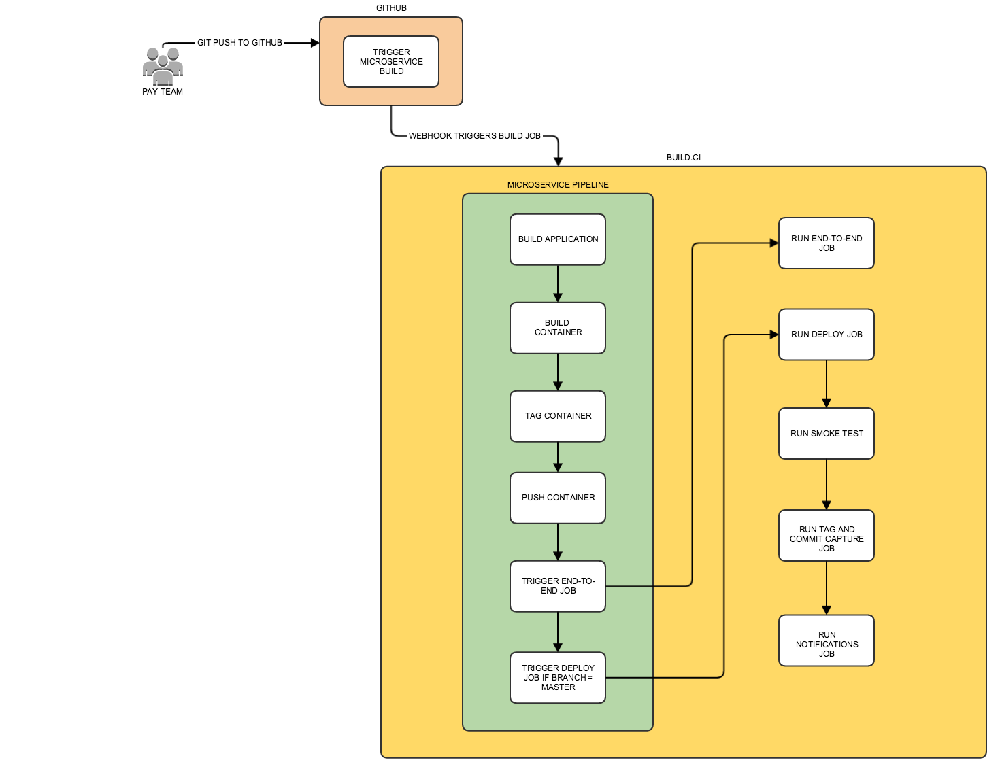

# What

pay-jenkins-library is a Jenkins library helper, intended to be used
with GOV.UK Pay Jenkins.

This library gets automatically loaded and made available via Jenkins global libraries.

If you want to have Jenkinsfile pull in a branch of this repo, add the below to your
Jenkinsfile.

```
libraries {
  lib("pay-jenkins-library@master")
}
```
### Functions this Jenkins global library

#### Git tag

- Tags the current git repo with the provided tag
- Pushes the tag to the remote repository
- Optional second argument for an annotation

```groovy
    gitTag(tag, annotation)
```

#### Build app

- Builds a docker container, tags and pushes to a registry
  Only 'app' is required, the rest default to the below

```groovy
buildAppWithMetrics {
  app = 'foo'
  registry = 'docker.io'
  docker_repo = 'govukpay'
  push = true
}
```

*NOTE:* If app is frontend or selfservice, it also builds the test docker container, runs the tests and compiles static assets,
prior to the standard behaviour

#### Run end to end test

- Runs specified e2e tests, pulling docker tag of specific app

```groovy
runAppE2E('app-name', 'card,products')
```

#### Get current HEAD of branch i.e. GIT_COMMIT

```
gitCommit()
```

#### Deploy a microservice to an environment

- Deploys a microservice to an environment by triggering
  the deploy job passing in params.
  `tag` is optional, defaults to 'latest-master'
  `tagAfterDeployment` is optional, defaults to false
  `run_tests`, is optional, defaults to true
  `smoke_tags`, is optional, defaults to empty string
  `promoted_env`, is optional, defaults to true

```
deployEcs('microservice', 'aws_account', tag, 'tagAfterDeployment', 'run_tests', 'smoke_tags', 'promoted_env')
```

## Example microservice build pipeline



## Licence
[MIT License](LICENCE)

## Responsible Disclosure
GOV.UK Pay aims to stay secure for everyone. If you are a security researcher and have discovered a security vulnerability in this code, we appreciate your help in disclosing it to us in a responsible manner. We will give appropriate credit to those reporting confirmed issues. Please e-mail gds-team-pay-security@digital.cabinet-office.gov.uk with details of any issue you find, we aim to reply quickly.
